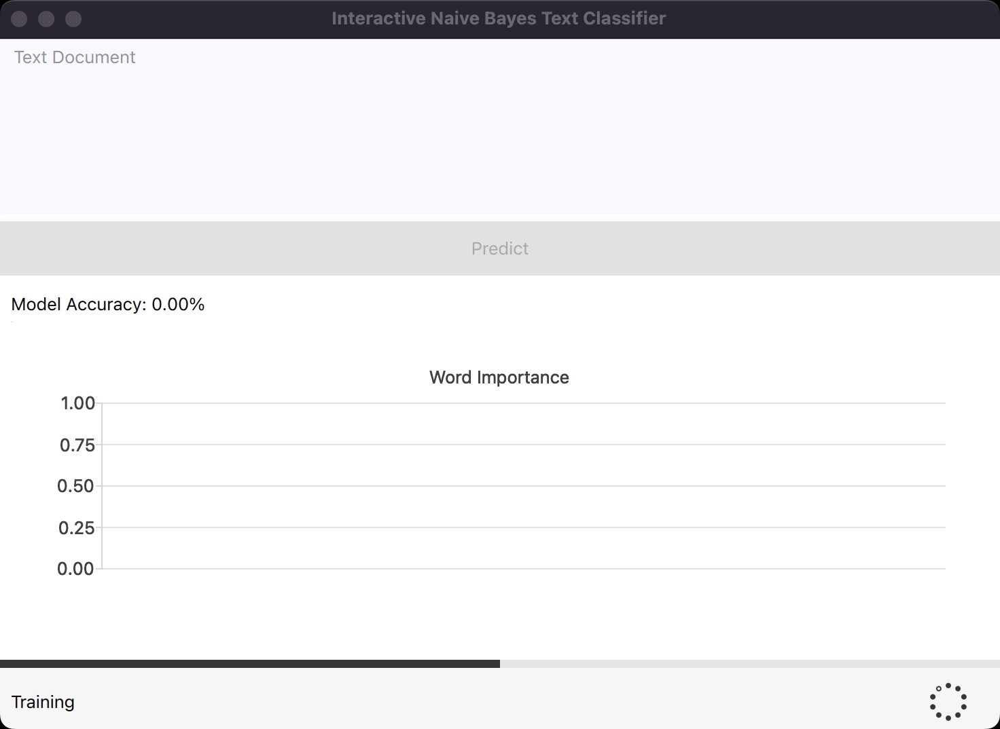
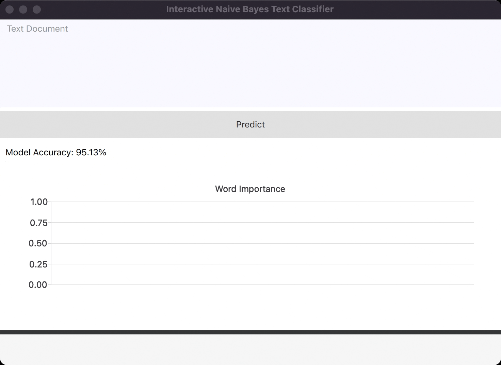

# Programming Assignment 1: Interactive Naive Bayes Text Classification

## Previews

### Training



### Prediction



### Interaction


## Getting Started

Install Python 3.10.x.

Install Poetry **1.2 or later**. See [Poetry's documentation](https://python-poetry.org/docs/) for details.

> Poetry earlier than 1.2 will not work with this project.

Install the project's dependencies:

```sh
poetry install --no-root
```

Activate the virtual environment:

```sh
poetry shell
```

Start the application:

```sh
python main.py
```

> Make sure you are in the project's root directory and your have activated the virtual environment.

## Contributing

See [CONTRIBUTING.md](CONTRIBUTING.md) for details.
